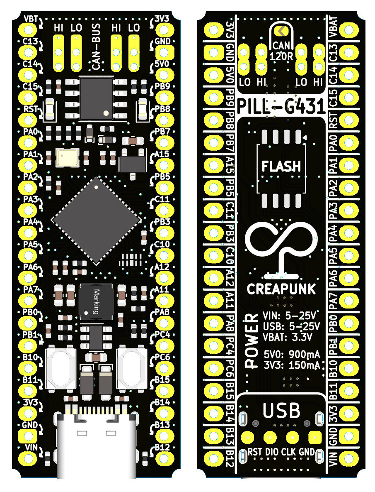
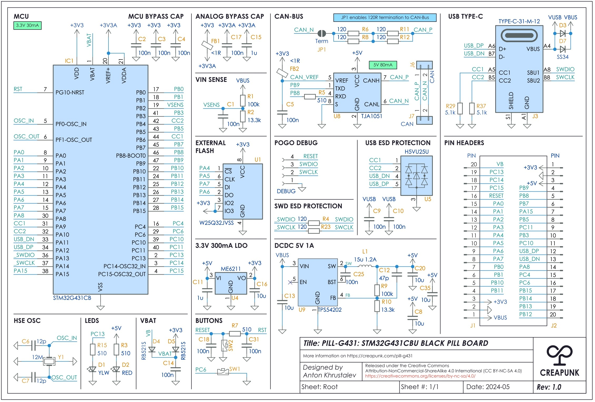

# PILL-G431 - STM32G431CBU BASED BLACK PILL BOARD

$6@25pcs BOM BLACKPILL-sized and almost fully pin-compatible development board with integrated CAN-FD 5MBit/s transceiver, 5-25V input, 5V 1A output DC-DC converter, support for ST UCPD for Power Delivery, and optional external FLASH memory.

## Specification

💻 **MCU:** High-performance Arm Cortex-M4 MCU **STM32G431CBU** up to **170MHz** with:

- **128KB Flash** memory, **32KB SRAM** memory, and **1Kb OTP**
- Math accelerator with support for trigonometric function calculations
- True random number generator
- **Clock:** Internal 8MHz HSI and 32kHz RTC with external 12MHz HSE oscillator

⚡**Power:**

- **USB:** 5-25V 3A **input** with PD support*
- **VIN:** 5-25V 3A **input**
- **5V0:** 5V 900mA **output**
- **3V3:** 3.3V 150mA **output**

🔄 **Interfaces:**

- 1x USB 2.0 FS with UCPD hardware support*
- 1x CAN2.0/CAN-FD 5MBit/s with integrated transceiver and optional termination
- 1x SWD over Type-C (with pogo access)
- 3x SPI
- 2x I2C
- 2x UART

🕹️ **User Interaction:**

- Reset button + User button PC6
- Power indication LED + User LED PC13

### Potential Issues

> The board is currently untested, so there may be additional, unidentified issues.

#### UCPD Support

Hardware compatibility implemented according to [ST's recommendations](https://www.st.com/resource/en/application_note/dm00536349-usb-typec-power-delivery-using-stm32xx-series-mcus-and-stm32xxx-series-mpus-stmicroelectronics.pdf)

However, it is not confirmed whether this will work. To be safe, the board includes two 5.1k resistors to support the 5V 3A mode.

#### BOOT0 & DFU

DFU mode cannot be operated via the BOOT0 button because the PB8 pin shares CAN-Bus and BOOT0 functionality. The design decision favored CAN-Bus. BOOT0 is default HIGH due to the CAN-Bus transceiver logic.

DFU can still be used through:

- Program Bootloader Entry
- By setting nBoot0 OPTION BYTES
- Custom bootloader

## Schematic

## Supporting the Project

If this project resonates with you, please consider the following ways to support its development:

- **[Ko-fi](https://ko-fi.com/creapunk):** Membership subscription and one-time donations
- **Join [Discord community](https://discord.gg/V4aJdTja8v):** Stay updated, engage in discussions, and contribute to the project

**Your contribution, regardless of size, is greatly appreciated!** 

---

***Important Note:** This README will be updated to reflect the latest progress and changes in the project*.

